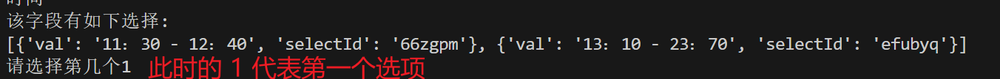

# 金山表单填写辅助脚本

#### 介绍

此项目可以对未开放的表单进行预处理解析，预处理解析后可以对字段进行填写，时间一到可以自动提交。

#### 使用说明

1. 此项目入口处为start.py文件
2. 此项目集成了多线程 ，若有bug，请留言

#### 表单链接获取途径

##### 1. 链接型（可直接使用)

##### 2. 二维码型
通过浏览器扫描二维码获取链接，截取最后面反斜杠的字符，与 https://f.kdocs.cn/g/ 拼接即可
这是通过浏览器扫描后的链接（获取红色部分）

拼接后链接如下：
https://f.kdocs.cn/g/JtE2WBT7
##### 3.小程序型

#### 说明
1. 本程序对于多选项暂时不支持
2. 对于选项环节从  **1**  开始（ **非0** ）

#### 注意事项
1. 此项目主要用于学习，交流，不可用于损害他人利益，请勿用于非法用途。
2. 此项目主要是辅助化办公，不建议使用此脚本抢占具有名额限制的表单。
